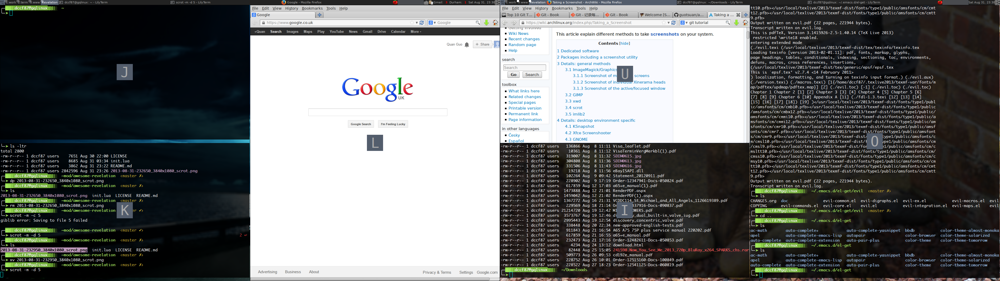

# revelation.lua

Provides Mac OSX like 'Expose' view of all clients. 

It is modified from the original revelation.lua. 

## Changes after 2013-12-30
* now it is possible in revelation.init({...}) to change the default settings of 
  revelation module.

* revelation(...) now accept the paramster as table. to add specify rules 
  revelation({rule={...}, is_excluded=true or false, curr_tag_only = ture or 
  false)
  when curr_tag_only is true, the module only collect the cliens from current
  tags.

## Changes from the original revelation
* Support awesome 3.5 or later 

* Add the support of multiple screens. Now multiple 'Expose' views will be shown 
  on the multiple screens at the same time.

* The way of selecting and focusing the client was changed. The old way that is
  navigating clients by pressing the keys "j, h, k, l"  and then focusing the
  client by pressing key "Enter" was deprecated. Now each client in the 'Expose'
  views come with a hint box with a letter, you can select and focus the client
  by pressing the corresponding letter.  This method including codes was copied from the [module
  hint](https://github.com/zackpete/hints). 
  
* Add zoom mode. Add the function of zooming the client by pressing the right
  button of the mouse.

* The unwanted clients can be excluded by rules. 

## Screenshot

## Use

### Installation
 (From user's awesome configuration directory, usually ~/.config/awesome)

 1. Clone repository:

        git clone https://github.com/guotsuan/awesome-revelation.git

 2. put near the top of your rc.lua `local revelation=require("revelation")`

 3. put the `revelation.init()` after the `beautiful.init()`

 3. Make a global keybinding (ModKey + e) for revelation in your rc.lua:

        globalkeys = awful.util.table.join(
        awful.key({ modkey,           }, "Left",   awful.tag.viewprev       ), 
        awful.key({ modkey,           }, "Right",  awful.tag.viewnext       ),
        awful.key({ modkey,           }, "Escape", awful.tag.history.restore),
        awful.key({ modkey}, "e", revelation),  -- Insert this line

        awful.key({ modkey,           }, "j",
        function ()
            awful.client.focus.byidx( 1)
            if client.focus then client.focus:raise() end
        end),

    **NOTE:** Always double check this key binding syntax against the version of
    Awesome that you are using.

 4. Reload rc.lua and try the keybinding __Modkey + e__

 It should bring all clients to the current tags on all screens and set the layout to fair.
 You  can focus clients with __cursor__ then press the __left__ button to select, or you can 
direct focus on the client by pressing the corresponding key shown in the hint box. 
Press the mouse right button to zoom the client 
or __Escape__ to abort.

### Configuration
 Revelation's configuration is done through the init() function
 
 There are two basic settings, shown with default values:

    -- The name of the tag created for the 'exposed' view
    revelation.tag_name = 'Revelation'

    -- A table of matcher functions (used in client filtering)
    revelation.exact = awful.rules.match
    revelation.any   = awful.rules.match_any

 The rule matching functions must conform to `awful.rules.match` prototypes.

 For client matching rules, we follow the same syntax as awful.rules with one
 perk; if `rule.any == true`, then we call the `config.match.any` function.

to change the settings, use:

     revelation.init({tag_name = ..., match={...})

### Examples
 All clients:

     awful.key({modkey}, "e", revelation)

 To match all urxvt terminals:

     awful.key({modkey}, "e", function()
                revelation({rule={class="URxvt"}})
             end)
 To match clients with class 'foo' or 'bar':

     awful.key({modkey}, "e", function()
                revelation({
                            rule{class={"foo", "bar"},
                            any=true}
                            })
            end)

 To exclude the clients,  we set:

     awful.key({modkey}, "e", function()
             revelation(rule={class="conky"}, is_excluded=true)
             end)

 To set only collect clients from current tag

     awful.key({modkey}, "e", function()
                 revelation(rule={class="conky"}, is_excluded=true, 
                curr_tag_only=true)
                 end)

## Credits

### Maintenance
    * Quan Guo <guotsuan@gmail.com>
    * Perry Hargrave <resixian@gmail.com>

### Contributions, many thanks!
    * Nikola Petrov <nikolavp@gmail.com>

### Original authors
    * Espen Wiborg <espenhw@grumblesmurf.org>
    * Julien Danjou <julien@danjou.info>

## License
    Revelation is released under the GNU General Public License, version 3.
    (c) 2009-12 Perry Hargrave
    (c) 2008 Espen Wiborg, Julien Danjou
